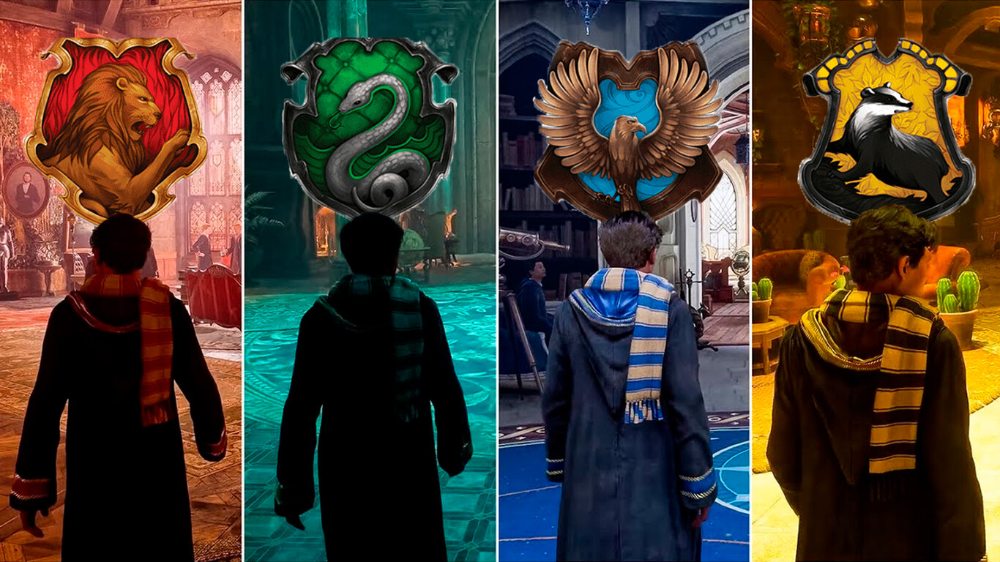

# Hogwarts Legacy : L'Héritage de Poudlard

Hogwarts Legacy : L'Héritage de Poudlard est un jeu vidéo de rôle (RPG) développé par Avalanche Software et édité par Warner Bros. Interactive Entertainment en collaboration avec Portkey Games. Le jeu sort en février 2023 sur PlayStation 5, Xbox Series et PC (Windows, via Epic Games Store et Steam) ; en avril 2023 sur PlayStation 4 et Xbox One, et en juillet 2023 sur Nintendo Switch.

Ce jeu prend place dans le monde des sorciers créé par J. K. Rowling, sans qu’elle ne soit toutefois impliquée dans le développement et le scénario du jeu.

En 2022, Hogwarts Legacy est considéré par certains journalistes comme le jeu vidéo le plus attendu de l'année.

Initialement prévue pour 2021, la sortie du jeu a été par la suite annoncée pour Noël 2022. En août 2022, Avalanche Software annonce le report du jeu pour le début de l'année suivante, avec une première date précise de sortie. 

---

## Trame

### Histoire

L'intrigue se déroule dans l'univers étendu de fantasy imaginé par J. K. Rowling pour les romans Harry Potter et les films Les Animaux fantastiques. Elle suit l'évolution d'un sorcier ou d'une sorcière, c'est-à-dire la personne qui joue au jeu, au sein de l'école de sorcellerie de Poudlard, à la fin des années 1800, soit antérieurement aux événements des deux séries de Rowling.

La première phase du jeu est une phase d'intégration et de découverte de Poudlard, de ses cours de magie et des environs du domaine. Le personnage incarné, doté d'une magie ancienne et singulière, est intégré directement en cinquième année d'études, et apprend à développer ses capacités magiques en lançant divers sortilèges, en préparant des potions et en apprivoisant des animaux fantastiques.

Au cours de sa progression dans le jeu, le personnage comprend que la magie particulière qu'il détient est convoitée par les gobelins et les mages noirs pour détruire le monde des sorciers3,4.

Les histoires s'adaptent au parcours choisi par la personne qui joue et il est possible de sélectionner ses compagnons pour évoluer dans le jeu.

### Personnages

Le personnage principal peut être masculin ou féminin, et entièrement personnalisable. Au cours de l'aventure, il est guidé par plusieurs protagonistes, tel que l'énigmatique professeur Eleazar Fig, qui l'informe d'une potentielle rébellion d'un groupe de gobelins mené par un certain Rannrok, et de la menace qui pèse sur Poudlard.

Le personnage fait la connaissance de plusieurs autres élèves notables, amenés à l'aider dans ses quêtes et à lui confier leur histoire, tels que Natsai Onai, une élève courageuse de Gryffondor motivée par sa soif de justice ; Poppy Sweeting, de Poufsouffle, une élève altruiste fascinée par les créatures magiques, ou encore Sebastian Pallow (Sallow en anglais), un élève de Serpentard charismatique, cachant un lourd secret de famille. Grignet (Deek), un elfe de maison, aide la personne qui joue à organiser la salle sur demande selon ses besoins et à découvrir ses fonctionnalités particulières.

### Système de jeu

Hogwarts Legacy est un jeu de rôle (RPG) d'action-aventure en monde ouvert. Il se joue en mode solo et en vision objective.

Dans le menu de création de son personnage en début de jeu, la personne peut choisir son apparence (forme du visage, yeux, couleur de peau, cheveux, accessoires), sa tonalité de voix, ses nom et prénom, sa maison de Poudlard ainsi que son dortoir (filles ou garçons).

L'avatar progresse dans le jeu en étant équipé d'une baguette magique. Un système de moralité est également présent : les missions et scénarios ne sont pas les mêmes selon les choix de la personne et les valeurs qu'elle décide de défendre au cours de l'aventure.

---

## Maison de Poudlard

La maison de Poudlard (Gryffondor, Poufsouffle, Serdaigle ou Serpentard) peut être choisie librement par la personne en début de jeu. Elle peut également être attribuée en fonction du test de J. K. Rowling effectué au préalable sur le site Pottermore - Wizarding World : le compte Pottermore de la personne doit pour cela être relié à un compte [Warner Bros games](https://fr.wikipedia.org/wiki/Warner_Bros._Interactive_Entertainment) pour que cette personne soit répartie dans la maison correspondante au test.

Selon la maison d'attribution, la couleur de l'uniforme et la salle commune sont différentes.

---

## Baguette magique

L'avatar est équipé d'une baguette magique, qui constitue à la fois son arme et son outil principal pour exercer la magie. Comme pour la maison d'attribution, les caractéristiques de la baguette peuvent correspondre, si la personne le décide, à celles qui lui sont attribuées sur son compte Pottermore.

---

## Talents et compétences

Pour améliorer ses compétences, le personnage peut participer aux cours mentionnés dans les romans, comme la défense contre les forces du Mal, la botanique, les potions ou les sortilèges, notamment. Certains cours sont obligatoires pour pouvoir suivre l'histoire principale, tandis que d'autres sont facultatifs. L'architecture des salles de cours s'inspire des salles matérialisées dans les films Harry Potter et Animaux fantastiques. L'élève a la possibilité d'explorer le château et de découvrir des passages secrets et des énigmes nécessitant certaines compétences magiques pour être résolues.

Le personnage incarné a accès à un certain nombres d'améliorations, « talents » et compétences au cours de l'aventure afin de progresser en tant que sorcière ou sorcier. Il est possible d'accomplir des quêtes et relever des défis pour gagner de l'expérience, renforcer ses compétences avec des « talents » qui améliorent ses sortilèges, ses plantes et ses potions en augmentant leur puissance. La personne peut choisir ses talents afin qu'ils correspondent à son style de jeu ; cela lui permet de s'orienter vers une forme de magie spécifique.

Les équipements peuvent être trouvés, achetés ou fabriqués, puis améliorés et spécialisés, afin d'optimiser les compétences d'attaque et de défense pendant les combats et s'adapter au style de jeu choisi.

---

## Exploration

Le jeu est en monde ouvert : le personnage joué a la possibilité d'explorer librement le château, les jardins et les hameaux dans les collines aux alentours. Une carte globale accessible par le menu, ainsi qu'une mini-carte affichée dans le coin inférieur gauche de l'écran (optionnelle) permettent de se repérer plus facilement8. Les paysages évoluent au cours de l’année selon les saisons et la météorologie.

L'environnement de Poudlard propose diverses activités connexes6. Le personnage peut être amené à effectuer des mini-jeux, résoudre des énigmes et interagir avec les autres personnages et les éléments de décor. Ainsi, certains habitants ou marchands peuvent avoir une histoire à raconter ou une quête secondaire à confier, ce qui permet de gagner de l'expérience. Pour se déplacer, l'avatar peut marcher, courir ou voler (sur un balai ou sur le dos de certaines créatures). Les objets collectés ainsi que l'expérience obtenue s'affichent sous forme de pop-up pendant le jeu. Les quêtes s'affichent quant à elles à gauche de l’écran, au-dessus de la mini-carte.

Le village de Pré-au-Lard, avec ses magasins, permet notamment de se procurer des produits utiles (ingrédients et recettes de potions, graines de plantes magiques, vêtements et autres équipements). L'équipe a précisé que le jeu n'incluait aucun système pay-to-win, ni aucune microtransaction.

---

## Commentaires des joueurs.

> Ce jeu c'est trop de la bombe bordel !
> Vivement qu'on puisse draguer Hermione
> L'animation de la magie est extraordinaire !
> Dommage qu'il n'y ai pas [Dumbledore](https://fr.wikipedia.org/wiki/Albus_Dumbledore) quand même car le directeur de Poudlard est un vrai co**ard !
